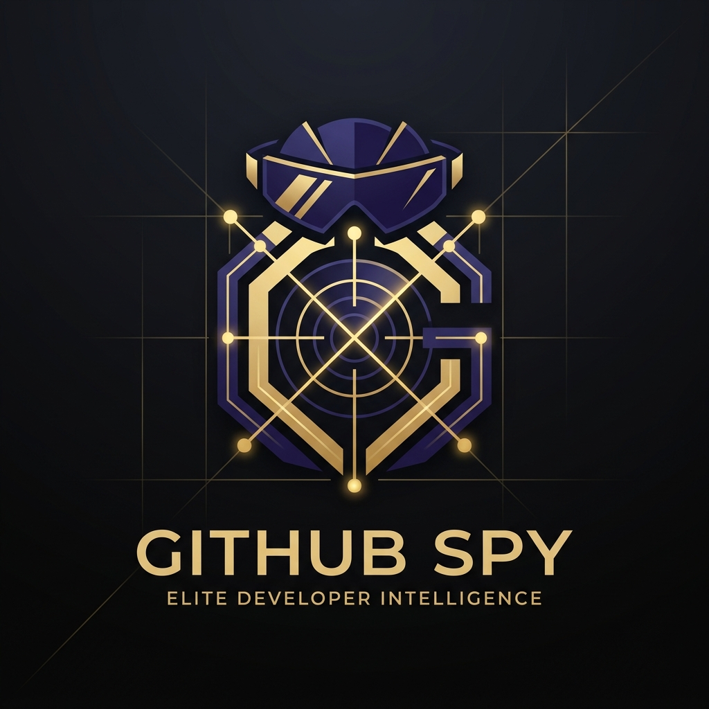
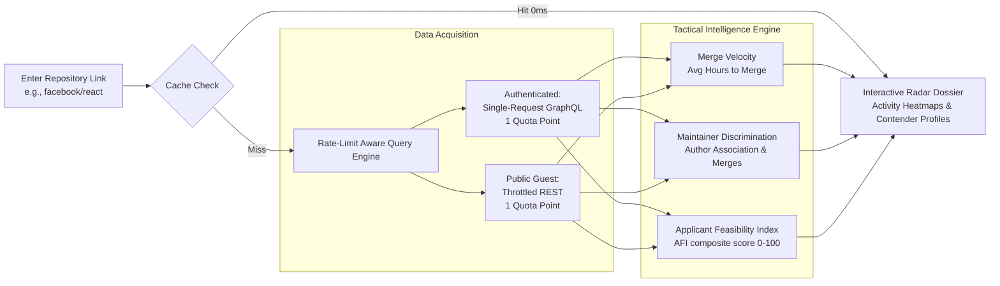
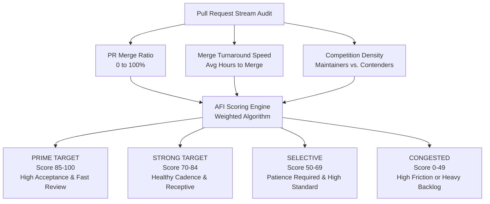
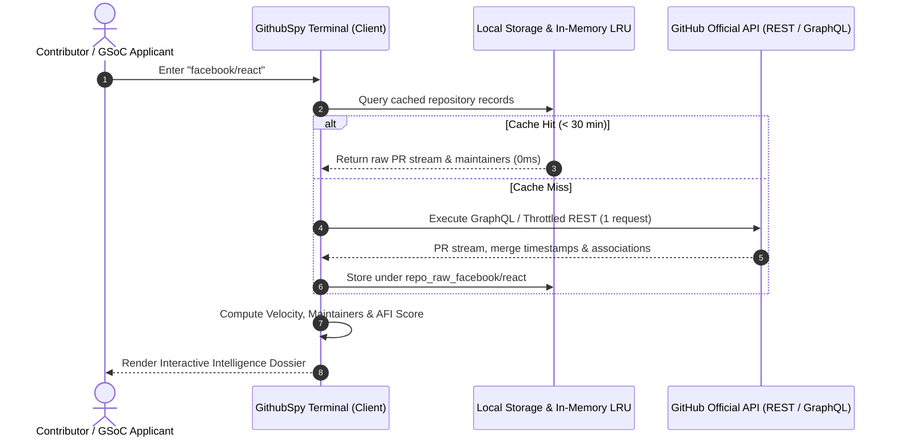

<div align="center">

  

  # GithubSpy

  ### Elite Open-Source Contributor Intelligence & GSoC Feasibility Radar

  <p align="center">
    <strong>Audits GitHub pull request merge velocity, unmasks active maintainers from community contenders, and calculates proprietary applicant feasibility ratings in real time.</strong>
  </p>

  <p align="center">
    <a href="https://github.com/TarunyaProgrammer/GithubSpy/blob/main/LICENSE"></a>
    <a href="https://github.com/TarunyaProgrammer"></a>
    <a href="https://vitejs.dev/"></a>
    <a href="https://docs.github.com/en/graphql"></a>
    <a href="https://www.w3.org/WAI/standards-guidelines/wcag/"></a>
    
  </p>

  <p align="center">
    <a href="#quick-overview">Quick Overview</a> •
    <a href="#how-it-works">How It Works</a> •
    <a href="#key-intelligence-features">Key Features</a> •
    <a href="#architecture-and-pipeline">Architecture</a> •
    <a href="#quick-start">Quick Start</a> •
    <a href="#license--attribution">License</a>
  </p>

</div>

---

## Quick Overview

When contributing to open-source or preparing a **Google Summer of Code (GSoC)** proposal, contributors frequently face high-friction uncertainties:
- *Do maintainers actually review and merge external pull requests?*
- *How long does review and merge typically take—hours, days, or months?*
- *How many other applicants are competing for maintainer attention in this repository?*

**GithubSpy eliminates the guesswork.** Enter any repository (`owner/repo`), and in under two seconds GithubSpy synthesizes a complete tactical intelligence dossier directly in your browser.

---

## How It Works



---

## The Applicant Feasibility Index (AFI)

The proprietary **Applicant Feasibility Index (AFI)** rates how receptive a repository is toward external contributors:



---

## Key Intelligence Features

| Feature | Description | Benefit |
| :--- | :--- | :--- |
| **Direct-to-Action Terminal** | Zero marketing bloat. Instant inspection from search hero or curated presets. | Instant answers in < 2 seconds. |
| **Applicant Feasibility Index (AFI)** | Proprietary composite score (0–100) and four-tier target classification. | Avoid stalled PRs and unresponsive projects. |
| **Maintainer Discrimination** | Accurately distinguishes core maintainers (`OWNER`, `MEMBER`, `COLLABORATOR`) from applicants. | Know exactly who possesses merge authority. |
| **Applicant Competition Density** | Isolates active non-maintainer contributors over the selected window. | Size up fellow applicant competition realistically. |
| **Merge Turnaround Velocity** | Computes true average latency from PR creation to merge timestamp. | Set accurate expectations for review turnaround. |
| **GraphQL Accelerator** | Bundles 100 PRs, maintainer logins, and review metadata into a single query. | Consumes only **1 API credit** per repository audit. |
| **Multi-Tier Hybrid Cache** | Dual-layer browser caching (`localStorage` + in-memory LRU with 30-min TTL). | Switching time filters (`24h`, `7d`, `30d`) costs **0 API requests**. |
| **Live Rate Limit Intelligence** | Live real-time hourly reset countdown with IP quota breakdown. | Complete transparency on API consumption. |
| **5,000 Req/Hr Ready** | Enter a free Personal Access Token stored 100% locally in browser storage. | 83x quota increase with zero backend proxy risks. |
| **Strict WCAG 2.2 AA** | High-contrast editorial palette, fluid responsive layout, keyboard accessibility. | Production-grade usability across all devices. |

---

## Architecture & Privacy Model

GithubSpy follows a **Strict Client-Side Zero-Backend Architecture**:

- **No Intermediate Servers**: All requests dispatch directly from your browser to GitHub's official API (`api.github.com`).
- **No Token Storage**: Personal Access Tokens (PATs) reside exclusively in your browser's private `localStorage` and never touch third-party servers.
- **Zero Tracking**: No user surveillance, no telemetry beacons, no third-party tracking scripts.
- **100% Free**: Built as a public utility to give back to the open-source and GSoC community.



---

## Quick Start

### 1. Clone & Install
```bash
git clone https://github.com/TarunyaProgrammer/GithubSpy.git
cd GithubSpy
npm install
```

### 2. (Optional) Configure Built-In Rate Limits
Copy the environment template:
```bash
cp .env.example .env
```
Optionally provide a personal GitHub token in `VITE_GITHUB_TOKEN` to grant 5,000 requests/hour by default without requiring manual token entry in the UI.

### 3. Run Locally
```bash
npm run dev
```
Open [http://localhost:3000](http://localhost:3000) in your browser.

### 4. Build for Production
```bash
npm run build
```
Generates a tree-shaken, optimized static distribution in `dist/` ready for zero-config deployment on Vercel, Netlify, or Cloudflare Pages.

---

## Deployment on Vercel

GithubSpy includes a production-ready [vercel.json](vercel.json) configuration with optimized cache headers and security rules:

```bash
npx vercel
```

---

## License & Attribution

This software is licensed under the **Strict Protective Source License (SPSL)**.  
Copyright (c) 2026 **[TarunyaProgrammer](https://github.com/TarunyaProgrammer)**. All Rights Reserved.

- **Mandatory Attribution**: All public deployments and derivative distributions must visibly retain copyright notices and unaltered links to [TarunyaProgrammer](https://github.com/TarunyaProgrammer).
- **No Unauthorized Re-branding**: Redistributing, white-labeling, or publishing this software under a different title or claiming original authorship is strictly prohibited.
- For complete terms, see the [LICENSE](LICENSE) file.

---

<div align="center">
  <p>
    <strong>100% Free & Open Source • Built with Precision for the Global Developer Community</strong>
  </p>
  <p>
    Authored and maintained by <a href="https://github.com/TarunyaProgrammer"><strong>@TarunyaProgrammer</strong></a>.
  </p>
</div>
